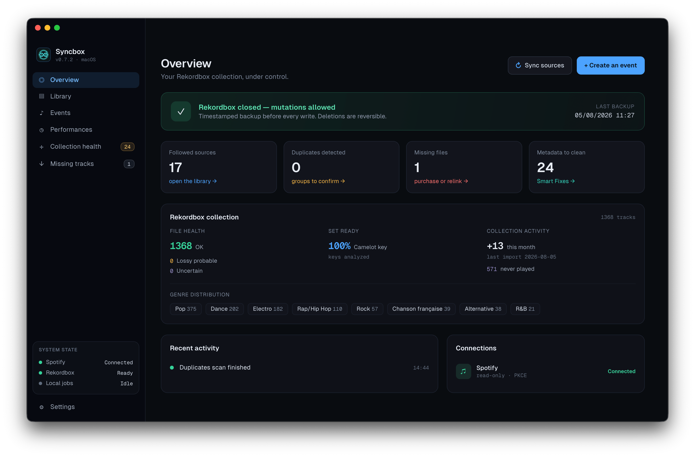
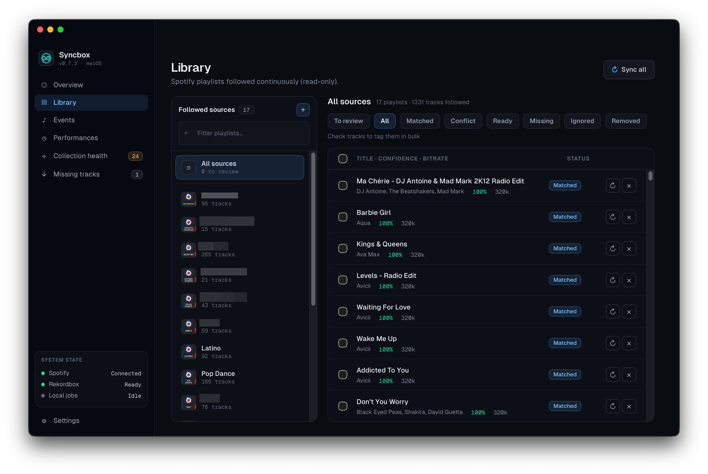
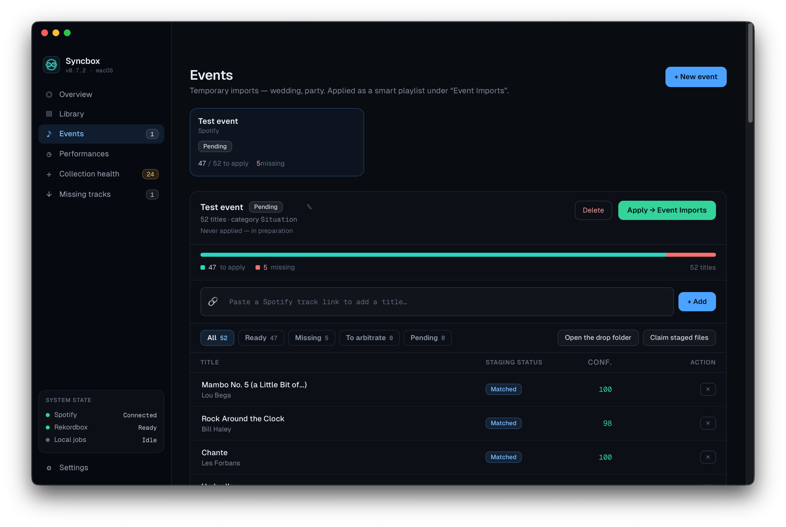
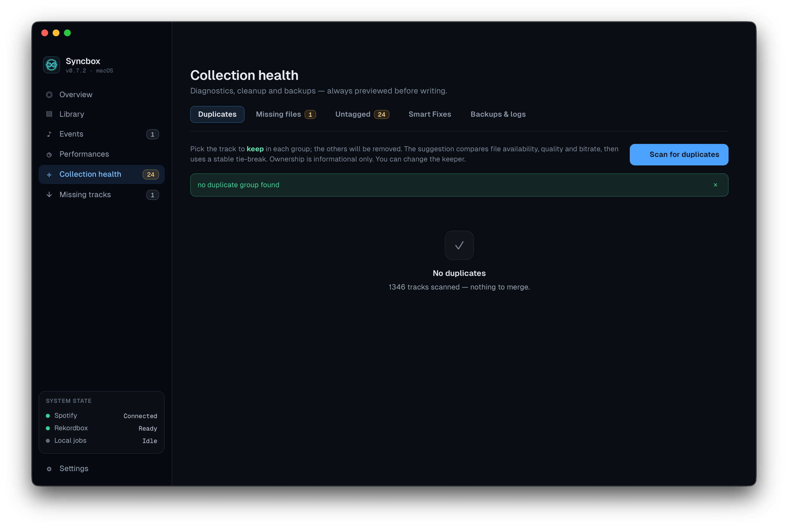
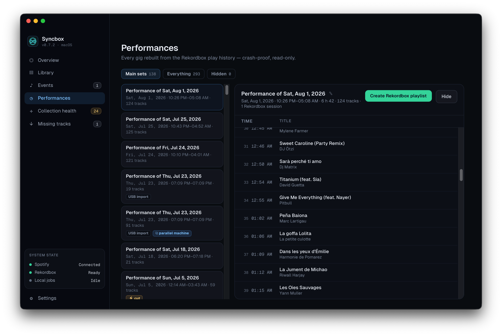

<h1 align="center">Syncbox</h1>

  <b>Find music in Spotify. Play it in Rekordbox.</b> 
  A macOS app that bridges the two — and keeps your DJ collection clean along the way.

  
  
  
  

## What is Syncbox?

Spotify is where most DJs find music. [Rekordbox](https://rekordbox.com) is
where they play it. Nothing connects the two, so the crate you built all week
has to be rebuilt by hand before every gig.

Syncbox does that work for you. It reads the Spotify playlists you choose,
finds which of those tracks you already own, and writes the result back into
Rekordbox as tags and playlists. Along the way it cleans up what a collection
accumulates over the years — duplicates, broken file links, untagged tracks,
messy titles.

It runs entirely on your Mac. There is no account to create and no server to
sign in to.

## Who it's for

- You crate-dig in Spotify but perform from Rekordbox, and you retype the
  bridge between them before every set.
- Your collection has grown past the point where hand-tagging is realistic.
- You prepare gig-specific sets and want to know, in one place, which tracks
  you still need to buy.
- You want to know what you actually played six months ago.
- You do not want a tool improvising inside your Rekordbox database.

## Before you download

Honest limits, up front:

- **macOS 14 or later, Apple Silicon only.** No Intel build. No Windows build.
- **The app is ad-hoc signed** — it has no Apple Developer ID signature and is
  not notarized, so macOS will warn you the first time you open it. The
  [Install](#install) section shows what to do.
- **No auto-update.** New versions are downloaded manually.
- **Your data stays on your Mac.** No Syncbox account, no Syncbox server. The
  only network traffic is the Spotify requests you authorize, the store
  searches you open in your browser, and — if you ever enable it — the optional
  component and its lookups. What is requested and where it is stored is
  itemised in [docs/PRIVACY.md](docs/PRIVACY.md).
- **Free**, MIT-licensed, and built by one person.

## Features

### Find in Spotify, play in Rekordbox

*The problem:* you follow a playlist all month, then discover on Friday that
none of it is tagged in Rekordbox.

Add a Spotify playlist as a source and Syncbox matches every track against the
music you already own — first by the recording's unique industry identifier
(which both services carry), then by title and artist when that identifier is
missing. You review the proposed matches and choose which ones to apply.
Syncbox then writes them into Rekordbox as **MyTags**, Rekordbox's own tagging
system. Anything ambiguous stays a review item; nothing is applied silently.

### Events — one gig, one set

*The problem:* a gig has a name, a date and a tracklist. Rekordbox has a flat
pile of playlists.

Create an event from a Spotify playlist or a link. Syncbox turns it into a
MyTag and a smart playlist inside Rekordbox. Tracks you do not own yet are
listed as **missing**, with Beatport and Bandcamp searches so you can buy from
the store or the artist — purchase links remain the primary path. Events stay
open after you apply them: add tracks later, re-apply, and only the pending
delta is written. Nothing gets duplicated.

An optional Deezer component exists for tracks you cannot buy anywhere. It is
distributed separately, disabled by default, requires explicit setup, and is
never needed for anything else in the app.

### Collection health

*The problem:* after a few years, every collection carries duplicates, dead
file links, tracks that escaped your tagging habit, and titles still wearing
junk from wherever they came from.

- **Duplicates** — groups them, proposes the copy worth keeping (file
  availability, quality, bitrate), moves the losers' playlist and tag
  memberships onto the keeper so you lose nothing, and sends the losing files
  to the macOS Trash.
- **Missing files** — finds tracks whose audio file is gone. Relink them to a
  file you own, or remove them with a reversible soft delete.
- **Untagged** — surfaces tracks that slipped through your tagging workflow,
  using structural rules plus patterns you define.
- **Smart Fixes** — conservative metadata cleanup: trailing site junk,
  invisible whitespace, exact encoded entities, selected reversible mojibake,
  explicit featured credits, and known remixers added only where the field is
  empty. Stylized casing and ambiguous patterns are left alone. You see the
  complete before/after list, and it is re-checked field by field before
  anything is written.

Audio-quality analysis is local, read-only and deliberately cautious: a clearly
full spectrum reads as *consistent*, a lower cutoff reads as *uncertain*. A
cutoff alone cannot tell a lossy transcode from a legitimately band-limited
master, so an uncertain verdict never decides a duplicate keeper on its own.

### Performance history

*The problem:* you played a set that worked, and six months later you cannot
reconstruct it.

Syncbox archives your Rekordbox play history locally and groups it into
performances — surviving Rekordbox restarts, keeping overlapping sessions
apart, and flagging bursts that look like a USB import rather than an actual
set. While Rekordbox is running you get a live tracklist. Performances can be
renamed or hidden, and any one of them can be exported as an ordered playlist.

### Backups, logs and languages

Every change to Rekordbox is preceded by a timestamped backup, rotated
automatically and restorable from **Collection Health → Backups & logs**, where
the application logs live too. The interface is available in **French and
English**.

## Your collection is safe

Your Rekordbox database is the one file a DJ cannot afford to lose. Every
change Syncbox makes to it goes through the same guarded path:

- Rekordbox must be **closed** — Syncbox refuses to write while it is running.
- A **timestamped backup** is taken before every change.
- You approve an **exact preview**, and that preview is re-validated at the
  moment of writing. If the database changed in between, the write is aborted
  rather than applied to stale data.
- **Deletions are reversible by design**: entries are soft-deleted in the
  database, audio files go to the macOS Trash. Where a volume has no working
  Trash, Syncbox asks for explicit consent *before* anything irreversible.
- Your **ordinary library files are never moved or renamed**.

The full pipeline is documented in
[docs/USER_GUIDE.md](docs/USER_GUIDE.md#rekordbox-write-safety).

## Install

1. Download `Syncbox-0.7.2-macos-arm64.dmg` from the
   [latest release](https://github.com/Adridot/syncbox/releases/tag/v0.7.2),
   open it, and drag `Syncbox.app` into your Applications folder. A `.zip` of
   the same build is published alongside it if you prefer.
2. Open it once. Because the app is ad-hoc signed rather than signed with an
   Apple Developer ID, macOS will block it. Open **System Settings → Privacy &
   Security**, choose **Open Anyway**, then confirm **Open**. Apple describes
   this exception in
   [Open a Mac app from an unknown developer](https://support.apple.com/guide/mac-help/mh40616/mac).
3. Follow the onboarding. It asks for three things: your Rekordbox database
   (one click fills in the usual
   `~/Library/Pioneer/rekordbox/master.db`), a storage folder Syncbox can use,
   and — only if you want the Spotify features — a free Spotify developer
   Client ID. The app walks you through creating one; it takes about two
   minutes.

## FAQ

<b>Is there a Windows version?</b>

Not today. Version 1 targets macOS 14+ on Apple Silicon only; Windows is
deferred to a future version.

<b>Does it cost anything?</b>

No. Syncbox is free and MIT-licensed.

<b>Will it move or rename my music files?</b>

No. Ordinary library files are never moved or renamed. There is exactly one
exception: if you keep a track that was staged for an event, it is moved into
`<storage folder>/rekordbox/Collection/` when that event is removed, so it does
not disappear with the event.

<b>Does it need my Spotify password?</b>

No. Authorization happens in your own browser, on Spotify's site. Syncbox never
sees a password and never asks for a client secret. It requests read-only
access to your playlists — nothing else.

<b>Do I need Spotify Premium?</b>

Syncbox uses a Spotify developer application that you create and own. Spotify's
Development Mode requires the owner of that application to keep an active
Spotify Premium subscription, and limits it to five authorized users. Details
in [docs/PRIVACY.md](docs/PRIVACY.md).

<b>Can I undo something?</b>

Yes. A backup is taken before every change and can be restored from
**Collection Health → Backups & logs**. Database deletions are soft deletes,
and deleted audio files go to the macOS Trash.

<b>Where does Syncbox keep my data?</b>

Application data lives in `~/Library/Application Support/Syncbox`. Rekordbox
database backups live under `<storage folder>/_syncbox/backups`. Nothing is
uploaded anywhere. Back up your audio files separately — Syncbox's backups
protect Rekordbox metadata, not your music.

<b>Which Rekordbox versions work?</b>

Syncbox reads and writes the local Rekordbox database used by Rekordbox 6 and
7. Release validation includes a walkthrough against Rekordbox 7.2.16 on a
disposable copy; the evidence is indexed in
[docs/POC-EVIDENCE.md](docs/POC-EVIDENCE.md).

<b>How do I update?</b>

Download the new release and replace the app. There is no auto-updater. Your
settings, backups and history are kept.

## Documentation

| Document | What's in it |
|---|---|
| [User guide](docs/USER_GUIDE.md) | Every screen, step by step, plus the write-safety rules |
| [Privacy](docs/PRIVACY.md) | What Spotify data is used, where it is stored, how to delete it |
| [Distribution](docs/DISTRIBUTION.md) | Release contract, build reproducibility, signing posture |
| [Specification](docs/SPEC-UNIFIED.md) | The product and architecture specification |
| [Validation evidence](docs/POC-EVIDENCE.md) | Release validation and historical proof-of-concept records |

## Contributing & support

- Something broken, or a question → [SUPPORT.md](SUPPORT.md)
- Want to build or change it → [CONTRIBUTING.md](CONTRIBUTING.md)
- Suspected vulnerability → [.github/SECURITY.md](.github/SECURITY.md), never a
  public issue

## Roadmap & current limits

- **Signing and notarization** — deferred. The app is ad-hoc signed, and
  credentials are held in a per-install encrypted store rather than the
  Keychain. OAuth tokens are never exported.
- **Windows** — deferred to a future version.
- **Automatic updates** — not implemented.
- **Optional acquisition** — purchase links remain first. The Deezer component
  is explicit, disabled by default, distributed separately, and requires a
  Premium credential kept in the encrypted store. SoundCloud and ffmpeg are not
  exposed. Only acquire music when your account and local law allow it.
- **Later** — previewing audio from your library, fingerprint-based duplicate
  detection, richer identifier enrichment.

## License

[MIT](LICENSE).

The packaged app bundles third-party components under their own licenses,
including [mutagen](https://github.com/quodlibet/mutagen) (GPL-2.0-or-later),
MPL-2.0 dependencies, and the PyInstaller bootloader under its GPL exception.
The separately distributed component carries deezer-py (GPL-3.0-or-later),
mutagen, streamrip's exact GPL-3.0-only license, its pinned source revision, a
source-availability notice, and its own dependency inventory. The generated
notices shipped with each release are authoritative; this summary is not a
legal-compliance claim.
