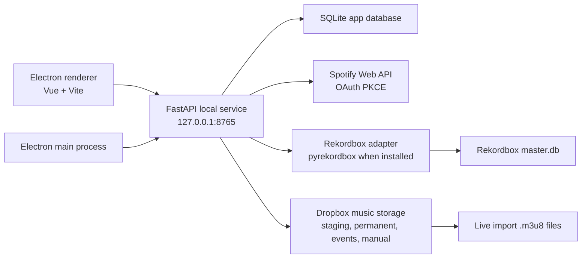

# Architecture

## Process Layout



## Safety Model

- The Python service checks running processes before any Rekordbox mutation.
- Mutations are blocked when `rekordbox` or `rekordboxAgent` is detected.
- Backup creation is part of the mutation boundary, not an optional UI action.
- Deletion candidates are represented as proposals and require manual approval.
- Live import writes only app-managed folders and `.m3u8` playlist files; it does not mutate the Rekordbox database.

## Sync Model

- Spotify playlist imports use playlist IDs, snapshots, track IDs, ISRCs, names, artists, and durations.
- Matching is conservative: ISRC first, then normalized title, artist, and duration.
- Ambiguous matches stay in the review queue.
- Missing tracks move to `ready` after a staged audio file is matched or manually assigned.
- Manual collection files are protected from automatic deletion proposals.
- Event imports tag tracks with the event name by default.
- Additional default tags come from configurable source playlist rules.
- Permanent tracks are moved to `_rekordbox_sync/permanent` and can be pushed to mapped Spotify playlists.

## Storage Model

The app-managed folder structure under the configured Dropbox music storage root is:

```text
Jockey Tricolore/Musique/
_rekordbox_sync/
  inbox/
  permanent/
  events/
    <event-slug>/
      audio/
      <event-slug>.m3u8
  manual_collection/
  backups/
```

The exact root can be changed in settings, but the subfolder names are stable so sync logic can identify protected files.
